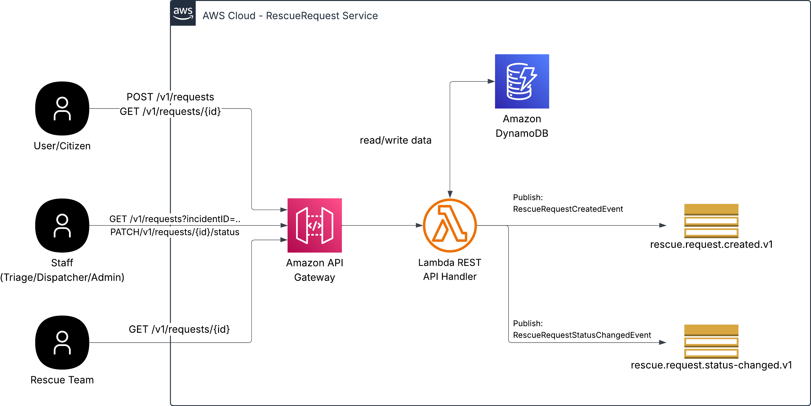
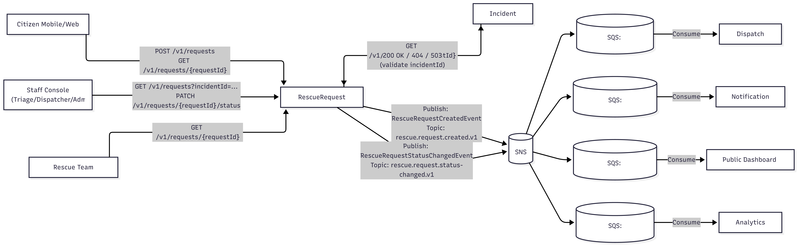

# Rescue Request Service (AWS Lambda + API Gateway + DynamoDB + SNS/SQS)

บริการ “ศูนย์กลางรับคำร้องขอความช่วยเหลือ” สำหรับสถานการณ์ภัยพิบัติ ด้วยสถาปัตยกรรมแบบ **Synchronous (REST)** + **Asynchronous (Event-driven)**

- REST สำหรับงานที่ต้องตอบทันที (สร้างคำร้อง/เช็คสถานะ/ค้นหา/เปลี่ยนสถานะ)
- Event สำหรับกระจายงานไปบริการปลายทาง (Dispatch/Notification/Dashboard/Analytics) โดย **SNS → SQS per consumer + DLQ**

---

## Contents
- [Architecture](#architecture)
- [Explanation](#explanation)
- [Service Interaction](#service-interaction)
- [REST API](#rest-api)
- [Event Contracts](#event-contracts)
- [Repository Structure](#repository-structure)
- [Local Development (SAM + LocalStack)](#local-development-sam--localstack)
- [Run Tests](#run-tests)
- [Deploy to AWS (CloudFormation)](#deploy-to-aws-cloudformation)
- [Operations & Troubleshooting](#operations--troubleshooting)
- [Conventions](#conventions)

---

## Architecture

เอกสารประกอบ:
- Proposal: [`docs/RescueRequest_Service_Proposal-6609612160_V01.pdf`](docs/RescueRequest_Service_Proposal-6609612160_V01.pdf)
- Architecture Diagram: [`docs/Service_Architecture_V01.jpeg`](docs/Service_Architecture_V01.jpeg)
- Service Interaction Diagram: [`docs/Service_Interaction_V01.png`](docs/Service_Interaction_V01.png)

### Architecture Diagram


**Components**
- **Citizen Client (Mobile/Web)**: ส่งคำร้อง, ตรวจสอบสถานะด้วย `trackingUrl` / `requestId`
- **Staff Client (Console)**: ค้นหา/เปลี่ยนสถานะ/ดู audit
- **Amazon API Gateway**: รับคำขอ REST + throttling/WAF + route ไป Lambda
- **Lambda (RescueRequest REST API Handler)**: ประมวลผล endpoints
- **Amazon DynamoDB (Owned Data Store)**:
  - `RescueRequests` (Master)
  - `RescueRequestState` (Snapshot/Current Status + version)
  - `RescueRequestEvents` (Audit Trail append-only)
  - `IdempotencyKeys` (TTL 24h)
  - `DuplicateIndex` (TTL short)
- **Amazon SNS (Event Bus)**: publish `created` และ `status-changed`
- **Amazon SQS per consumer + DLQ**: fan-out / retry / isolation


---

## Explanation

สถาปัตยกรรมของ RescueRequest Service แบ่งการทำงานออกเป็น 2 รูปแบบหลัก คือ **synchronous (REST)** และ **asynchronous (event-driven)** 

### 1) Synchronous (REST) สำหรับงานที่ต้องตอบทันที
ผู้ใช้งาน (Citizen/Staff) เรียกใช้งานผ่าน **Amazon API Gateway** แล้วส่งต่อไปยัง **Lambda REST API Handler** เพื่อประมวลผลคำขอแบบทันที เช่น สร้างคำร้อง, ดูสถานะ, ค้นหารายการ และอัปเดตสถานะ โดย Lambda จะอ่าน/เขียนข้อมูลกับ **DynamoDB** ซึ่งเป็นฐานข้อมูลที่บริการนี้เป็นเจ้าของ

ในการสร้างคำร้อง (`POST /v1/requests`) ระบบจะทำ **Strong Idempotency** ด้วย `X-Idempotency-Key` เพื่อรองรับการ retry จากเครือข่ายที่ไม่เสถียร และทำ **Duplicate Heuristic** เมื่อไม่มี key เพื่อลดคำร้องซ้ำ จากนั้นบันทึกข้อมูลลงตาราง Master/Snapshot และเพิ่ม **Audit Trail** แบบ append-only เพื่อให้ตรวจสอบย้อนหลังได้

### 2) Asynchronous (Event-Driven) สำหรับการกระจายงานไปบริการอื่น
เมื่อสร้างคำร้องสำเร็จหรือมีการเปลี่ยนสถานะ ระบบจะ publish event ไปยัง **SNS** เช่น `RescueRequestCreatedEvent` และ `RescueRequestStatusChangedEvent` เพื่อให้บริการปลายทางเริ่มทำงานต่อได้โดยไม่ต้อง block ผู้เรียก

เพื่อความทนทาน จึงทำ **fan-out ไปยัง SQS ต่อ consumer** ทำให้แต่ละบริการ (Dispatch/Notification/Dashboard/Analytics) สามารถรับ message ตามความเร็วของตนเอง มี retry และ **DLQ** ได้ ลดผลกระทบเมื่อบางบริการล่มหรือช้า

ด้วยการแยก REST path สำหรับการรับเรื่อง/ตรวจสอบสถานะ และ Event path สำหรับการส่งต่อผลลัพธ์และการแจ้งเตือน สถาปัตยกรรมนี้จึงช่วยให้ RescueRequest Service เป็น “ศูนย์กลางรับคำร้องที่เชื่อถือได้” รองรับโหลดสูง ลดข้อมูลซ้ำ และทำให้ทุกฝ่ายติดตามความคืบหน้าได้อย่างต่อเนื่องในสถานการณ์ภัยพิบัติ

---

## Service Interaction

### Service Interaction Diagram


### Upstream Services (บริการต้นทางที่เรียกใช้งาน RescueRequest Service)

**Citizen Mobile/Web App (Citizens)**
- เรียกสร้างคำร้องและตรวจสอบสถานะ  
  - `POST /v1/requests`  
  - `GET /v1/requests/{requestId}`

**Staff Console (Triage/Dispatcher/Admin)**
- เรียกค้นหา/บริหารคำร้องและเปลี่ยนสถานะ  
  - `GET /v1/requests?incidentId=...`  
  - `PATCH /v1/requests/{requestId}/status`

**Rescue Team App/System**
- เรียกดูรายละเอียด/สถานะเพื่อปฏิบัติงานหน้างาน  
  - `GET /v1/requests/{requestId}`

### Downstream Services (บริการปลายทางที่ RescueRequest Service เรียกหรือส่งข้อมูลไป)

#### A) Downstream แบบ Synchronous
**Incident Service**
- ใช้ตรวจสอบ/อ้างอิงว่า `incidentId` ถูกต้องและมีอยู่จริง (registry/validation)

#### B) Downstream แบบ Asynchronous (ส่งข้อมูลผ่าน Pub/Sub)
**Event Bus (SNS): ช่องทางกระจาย event**
- `rescue.request.created.v1` (`RescueRequestCreatedEvent`)
- `rescue.request.status-changed.v1` (`RescueRequestStatusChangedEvent`)

**Dispatch Service (ผ่าน SQS: `dispatch.inbox.v1`)**
- รับ event เพื่อเริ่มกระบวนการจัดสรรทีม/ยานพาหนะ

**Notification Service (ผ่าน SQS: `notification.inbox.v1`)**
- รับ event เพื่อส่ง SMS/Email/LINE แจ้งประชาชนเรื่องการรับเรื่อง/สถานะเปลี่ยน

**Public Dashboard Service (ผ่าน SQS: `dashboard.inbox.v1`)**
- รับ status-changed เพื่ออัปเดต dashboard แบบ near real-time

**Analytics Service (ผ่าน SQS: `analytics.inbox.v1`)**
- รับ event เพื่อทำสถิติ/รายงาน/heatmap และการติดตาม KPI

---

## REST API

Base path: `/v1`

### Endpoints
- `POST /v1/requests`
  - สร้างคำร้อง + strong idempotency (`X-Idempotency-Key`) + weak duplicate heuristic
- `GET /v1/requests/{id}`
  - ดึงรายละเอียดและสถานะล่าสุด
- `GET /v1/requests?incidentId=...`
  - staff search ตาม incident
- `PATCH /v1/requests/{id}/status`
  - เปลี่ยนสถานะ + optimistic locking (`version`) + audit trail

> Error policy: หาก Incident Service timeout → `503 INCIDENT_REGISTRY_UNAVAILABLE`

---

## Event Contracts

Schemas อยู่ที่:
- `contracts/events/rescue.request.created.v1.schema.json`
- `contracts/events/rescue.request.status-changed.v1.schema.json`

### Topics
- `rescue.request.created.v1-{stage}`
- `rescue.request.status-changed.v1-{stage}`

### SQS Fan-out 
- `dispatch.inbox.v1-{stage}` + `dispatch.dlq.v1-{stage}`
- `notification.inbox.v1-{stage}` + `notification.dlq.v1-{stage}`
- `dashboard.inbox.v1-{stage}` + `dashboard.dlq.v1-{stage}`
- `analytics.inbox.v1-{stage}` + `analytics.dlq.v1-{stage}`

---

## Repository Structure (Draft)

```text
rescue-request-service/
├─ README.md
├─ docs/
│  ├─ dependency-mapping.md
│  ├─ RescueRequest_Service_Proposal-6609612160_V01.pdf
│  ├─ Service_Architecture_V01.jpeg
│  └─ Service_Interaction_V01.png
├─ contracts/
│  └─ events/
├─ src/
│  ├─ handlers/
│  ├─ domain/
│  ├─ adapters/
│  └─ utils/
├─ tests/
│  ├─ unit/
│  └─ integration/
├─ infra/
│  ├─ cfn/
│  │  └─ template.yaml
│  ├─ params/
│  └─ sam/
│     └─ template.local.yaml
├─ local/
│  ├─ docker-compose.yml
│  └─ init/
├─ scripts/
│  ├─ build.sh
│  ├─ start-local.sh
│  ├─ bootstrap-local.sh
│  ├─ package.sh
│  └─ deploy.sh
└─ .github/workflows/